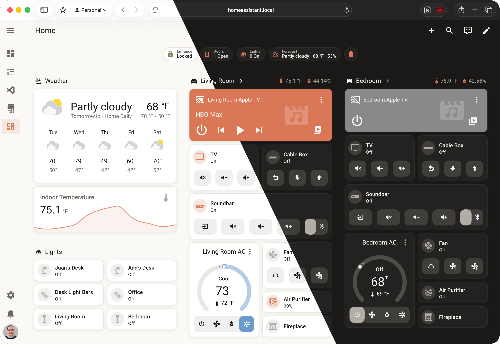
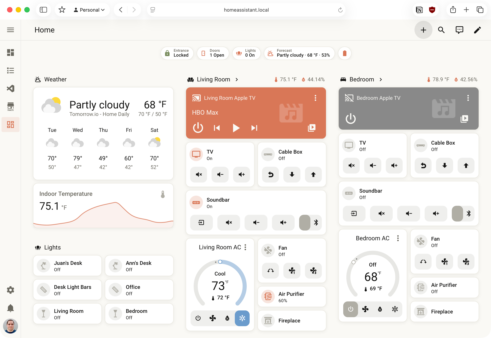
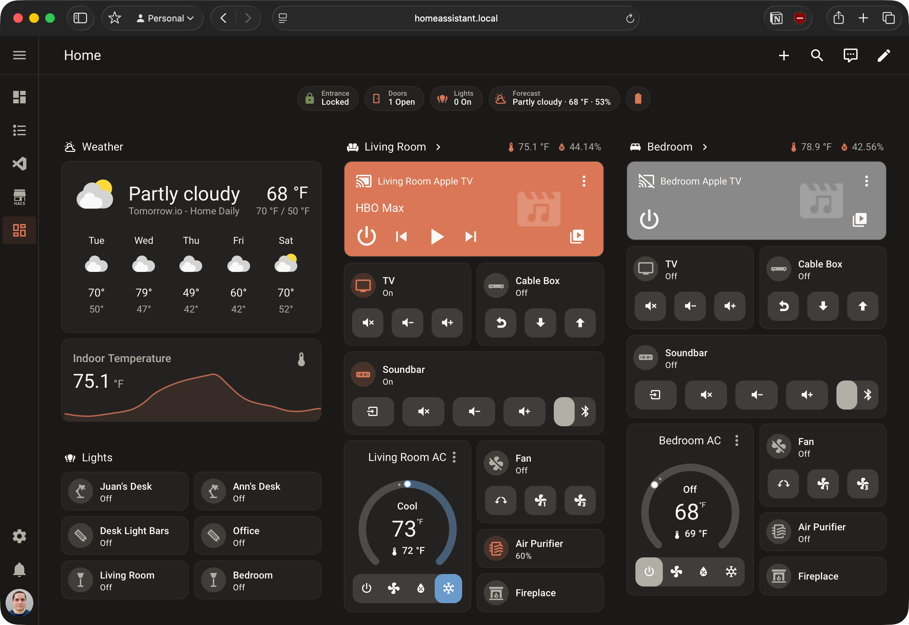
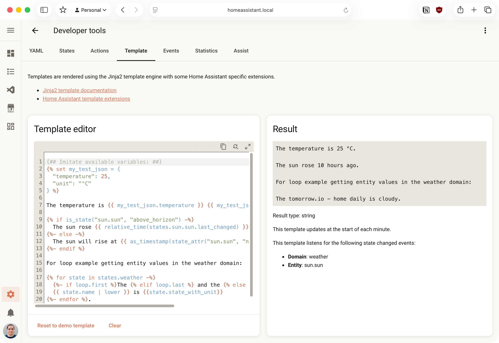
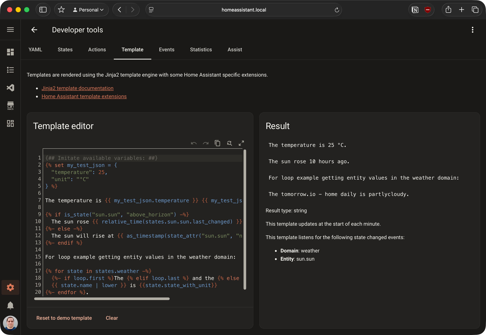
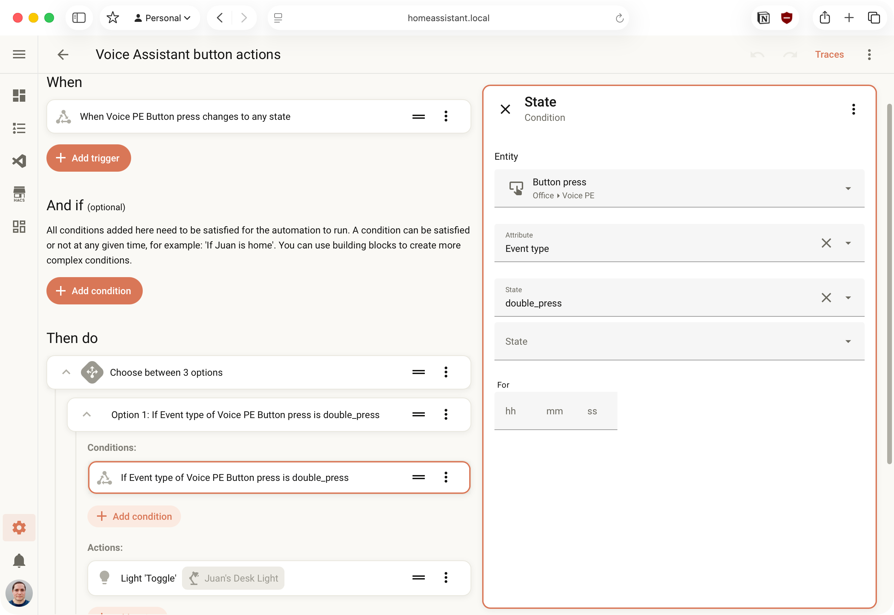
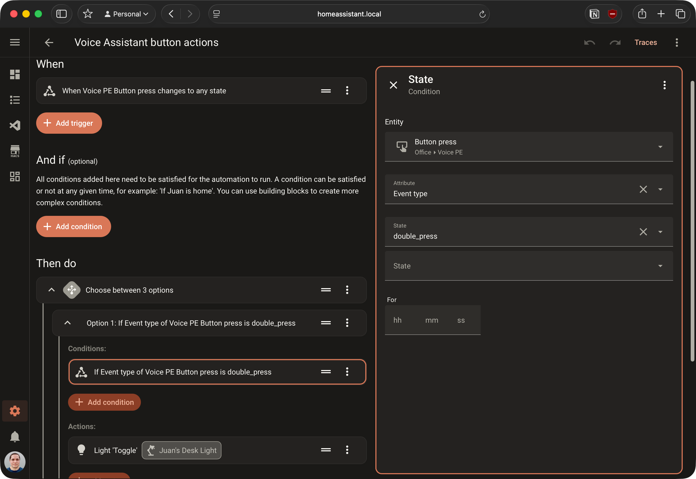

# Warm Ink — A Home Assistant Theme



</br>

A warm, grounded Home Assistant theme built around earthy neutrals and a signature terra cotta accent. Inspired by the [Anthropic / Claude](https://www.anthropic.com) color palette — designed to feel calm and deliberate rather than loud.

Available in both **light** and **dark** mode.

## Preview
<details>
<summary>Screenshots</summary>






</details>

## The Palette

Warm Ink draws its colors from a palette of warm grays, off-whites, and a burnt-orange terra cotta that runs through every active state, toggle, and accent in the UI. The sidebar and header intentionally share the same background as the main body, keeping the layout unified and distraction-free.

| Name | Hex | Role |
|------|-----|------|
| Cream | `#faf9f5` | Light mode background |
| Linen | `#e8e6dc` | Light mode secondary surface |
| Sand | `#b0aea5` | Muted icons and disabled states |
| Stone | `#6b6960` | Secondary text |
| Charcoal | `#3a3936` | Dark mode surface |
| Ink | `#141413` | Dark mode background |
| Terra | `#d97757` | Primary accent — active states, toggles, highlights |
| Sky | `#6a9bcc` | Accent blue — cool states, info |
| Fern | `#788c5d` | Success and nature states |


## Installation

### Via HACS (recommended)

> Requires [HACS](https://hacs.xyz/) to be installed in your Home Assistant instance.

**Option A — HACS Store** *(once listed)*

1. Go to HACS → Frontend.
2. Search for **Warm Ink** and click **Download**.
3. Follow steps 5–6 above.

**Option B — Custom Repository**

1. In Home Assistant, open HACS from the sidebar.
2. Click the **three-dot menu** in the top-right corner and select **Custom repositories**.
3. Enter the repository URL, set the type to **Theme**, and click **Add**.
4. Search for **Warm Ink** in HACS and click **Download**.
5. Reload themes: go to **Developer Tools → Actions**, search for `frontend.reload_themes`, and run it.
6. Open your [Profile settings](https://my.home-assistant.io/redirect/profile), under **User preferences**, select **Warm Ink** from the Theme dropdown.


### Manual Installation

1. Add the following to your `configuration.yaml` (a restart is required if this is your first theme):

   ```yaml
   frontend:
     themes: !include_dir_merge_named themes/
   ```

2. Create a `themes/` folder inside your Home Assistant config directory if it doesn't already exist.

3. Download `warm_ink.yaml` from the [latest release](../../releases/latest) and place it in that folder.

4. Reload themes: **Developer Tools → Actions → `frontend.reload_themes`**.

5. Open your [Profile settings](https://my.home-assistant.io/redirect/profile), under **User preferences**, select **Warm Ink** from the Theme dropdown.


## Light & Dark Mode

Warm Ink ships as a single file with both modes defined. Home Assistant will automatically offer both variants on the profile page. The active mode follows your browser or OS preference by default, or you can pin it manually from your profile.


## License

[MIT](./LICENSE) — free to use, adapt, and share.
